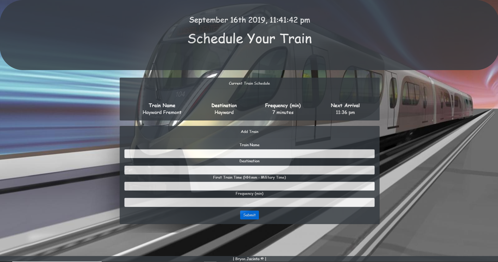

# Train-Schedule
### Links: 
 https://bryanjacinto1994.github.io/Train-Schedule/.
<br>
 https://github.com/bryanjacinto1994/Train-Schedule

## Images




<hr>

## Tools Used:

* Visual Studio Code - Open source code editor for building and debugging web and cloud applications.
* JavaScript - A scripting language that uses curly-bracket syntax, first class functions and object-oriented.
* jQuery - A JavaScript library that simplifys to manipulate HTML DOM.
* MomentJS - Free open source JavaScript Library to manipulate time without having the need to refresh the browser.
* HTML - Used to create elements on the DOM.
* CSS - Styles the html elements on page. 
* Git - Version control system to track changes to source code.
* Github - Hosts respository that can be deployed to GitHub pages.
* Firebase - A mobile and web application development platform.


<hr>

## Summary

Using HTML, CSS, JavaScript, jQuery library for JS via Visual Studio Code, and Firebase, I have created an application for users to schedule their own train destinations.

By using the firebase via google app, there is an api key that was used from the firebase onto the javascript file so we can track a users saved information everytime a user submits a train schedule information. This is converted into military time. As you can see on the image above, the format includes the train name, destination, frequency, and next arrival. The most challenging part about this is trying to get the submitted train schedule to append to the table body, but that error was fixed. 

The styling was used on a basic bootstrap configurations and with the use of opacity to make it look modern.

<hr>

## Code Snippet

HTML :
```html
<div class="container">
        <div class="card bg-dark" style="color: white;">
            <div class="card-header">
                Current Train Schedule
            </div>
            <div class="card-body">
                <blockquote class="blockquote mb-0">
                    <table style="width: 100%">
                        <thead>
                        <tr>
                            <th>Train Name</th>
                            <th>Destination</th>
                            <th>Frequency (min)</th>
                            <th>Next Arrival</th>
                            
                        </tr>
                        </thead>
                        <hr>
                        <tbody id="tableBody"></tbody>
                         </table>
                </blockquote>
            </div>
        </div>
    </div>
 
```
JavaScript: 

``` javascript
    dataRef.ref().on("child_added", function (snapshot) {
    var timeFreq = timeCompute(trainTime, trainFrequency);
    var minutesNext = timeFreq[0];
    var minutesAway = timeFreq[1];
    var tr = $("<tr>");
    var data = snapshot.val();
    var trainName = data.trainName;
    var trainDestination = data.trainDestination;
    var trainTime = data.trainTime;
    var trainFrequency = data.trainFrequency;
    


    tr.append("<td>" + trainName + "</td>" + "<td>" + trainDestination + "</td>"  + "<td>" + trainFrequency + " minutes</td>" + "<td>" + minutesNext + "</td>" + "<td>");
    $("#tableBody").append(tr);
},

    function (errorObject) {
        console.log("Errors handled: " + errorObject.code);
    });

function timeCompute(time, freq) {
    var tFrequency = time;
    var firstTime = freq;
    var firstTimeConverted = moment(firstTime, "hh:mm");
    var currentTime = moment();
    var diffTime = currentTime.diff(firstTimeConverted, "minutes");
    var tRemainder = diffTime % tFrequency;
    var tMinutesTillTrain = tFrequency - tRemainder;
    var nextTrain = currentTime.add(tMinutesTillTrain, "minutes");
    var trainFormat = [nextTrain.format("hh:mm a"), tMinutesTillTrain];
    return trainFormat;

```
CSS:
```css
*{
    text-align:center;
    font-family: 'Emblema One', cursive;
}
body{
    background-image: url("../images/train.jpg");
    background-position: center;
    background-repeat: no-repeat;
    background-attachment: fixed;
    background-size: cover;
    opacity: 0.8;
}

.jumbotron{
    height: 300px;
    
}

.card{
    color: black;
}

#Train-Schedule{
    position: relative;
    bottom: 28px;
}

```


## Author Links
Linkedin: https://www.linkedin.com/in/bryan-jacinto-100438aa/

Github:
https://github.com/bryanjacinto1994

